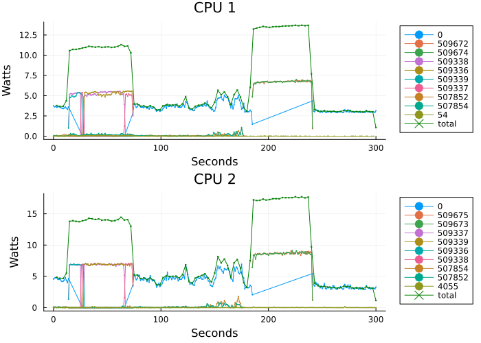

# eBPF Energy Monitor

_Proof of concept code to monitor process specific energy levels using eBPF_


## Example



## Setup

**Note**: this code is designed to currently _only work on my machine_. For example, the number of CPUs are hard-coded. That is to say, it will likely execute on your machine too, but will require adjustment to reflect your hardware topology.

- Requirements: eBPF needs to be enabled on your kernel, and the `libbpf` package must be installed on the system (e.g. via distro package manager).

```bash
zig build -Doptimize=ReleaseSafe
```

The above will build the (stripped) eBPF program to `zig-out/c-bpf.o` for inspection, but also embeds the binary in the userland executable for easy use. See the build file for details.

Due to the nature of eBPF syscalls, the program must be executed as root. It will then gather data and at the end of execution write the output to a `data.json` file.

```bash
sudo ./zig-out/bin/emon
```

As it executes, the program will display execution times and energy usages of each core / CPU depending on configured granularity.

The data file may be given to the analysis script in `analysis/analysis.jl` in order to create a plot like the above, showing the top 10 energy consuming processes per CPU, along with the total energy consumed by that CPU.

```
Top 5:
PID        0:    987113 ( 99%)   996122 ( 99%)   983130 ( 98%)   989343 ( 99%)
PID     2646:         0 (  0%)       93 (  0%)     4897 (  0%)     3388 (  0%)
PID   578679:         0 (  0%)        0 (  0%)     4658 (  0%)        0 (  0%)
PID     4055:      4481 (  0%)        0 (  0%)        0 (  0%)        0 (  0%)
PID   577994:      3594 (  0%)        0 (  0%)        0 (  0%)        0 (  0%)
----
Total number of procs: 82
----
Tot    (us) :           999937         1002248         1000084         1002199
Energy (uj) :                          3045158                         3050103
```

## How it works

The eBPF code latches on to the scheduler switches in order to record how long each process spent in the CPU, and stores this data in a per-CPU hashmap.

The userland code then periodically aggregates the contents of the hashmap. There are naturally timing issues here: in the time it takes to read the hashmap, more data will have been added to the hashmap from the eBPF program. Currently, nothing is done to check this other than that the entries are themselves then stored in a hashmap, such that if any PID data is read twice, the sum of the occupation times is taken.

For each PID on each CPU core, we calculate the occupation fraction, which is the fraction of time the core spent executing that PID.

Over the same interval, we read the Intel(R) RAPL sysfs to calculate the energy usage of each CPU socket. The assumption then is that the energy usage of each process will be proportional to the total execution time in the same interval, which means we calculate the energy usage of a given process in a given CPU as

$$
E_{\text{pid}, \text{cpu}} = \left(
    \frac{\sum_{i \in\text{cores}} t_{\text{pid},i}}
    {\sum_{i \in\text{cores}} T_{i}}
    \right) E_{\text{cpu}}
$$

where $t_{\text{pid},i}$ is the exeuction time for the process with PID in core $i$, and $T_i$ is the recorded time interval of the $i^\text{th}$ CPU.


## Uncertainty

There are obvious assumptions at play here. Additionally, there are a handful of synchronization issues that ought to be discusses:
- We check that the total time recorded over the sum of all PIDs for each core is approximately (to within $\sim 2\%$) equal to the userland recording interval. This is merely a sanity check done by the user reading the output, and no way enforced in the code.
- This latency error may be reduced by increasing the sampling interval to minimze the concurrency overlap of userland reading and eBPF writing.

## Related work

- I learned about [DEEP-mon](https://github.com/rolandobrondolin/DEEP-mon) whilst working on this which helped guide the design of this PoC.
